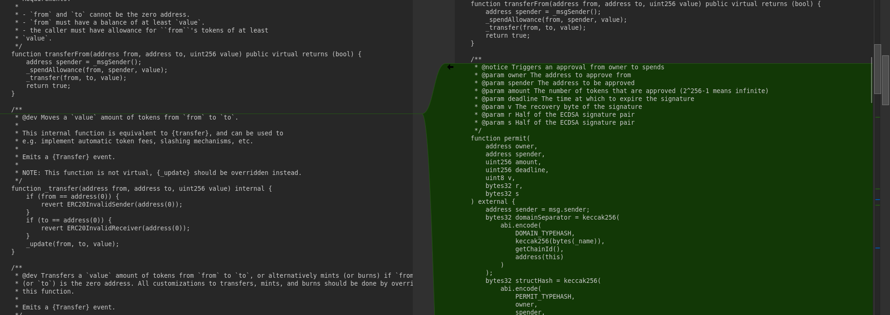

# Smart Contract Import Validator (SCIV)
The **Smart Contract Import Validator (SCIV)** is a simple Python script designed to help Solidity developers and auditors verify the integrity of imported contracts within third-party or foreign smart contracts. The tool ensures that the Solidity files claiming to import well-known libraries, such as OpenZeppelin contracts, have not been tampered with or modified in malicious ways. This can prevent scenarios where a contract might falsely present itself as using a secure, standard implementation while actually containing vulnerabilities.

The tool is particularly useful for identifying instances where a contract has been altered to introduce bugs or backdoors, yet falsely claims to use standard OpenZeppelin implementations.

## Setup
- Install Python 3 if not present already.
- Clone the OpenZeppelin Contracts repository.
- Install the required Python packages: `pip install gitpython tqdm`

## Usage
You can run the tool from the command line with the following syntax:

```
python sciv.py <solidity_file> <repo_path> [-v]
```

- <solidity_file>: The path to the Solidity .sol file that you want to check for tampering.
- <repo_path>: The relative or absolute path to the local clone of the OpenZeppelin repository.
- -v or --verbose: (Optional) Enables verbose logging for detailed output.

## Output
The tool tries to automatically find the referenced smart contract in your checked out repository with known, safe contracts. It lists all automatically matched contracts as well as all contracts which couldn't be automatically matched and need to be checked manually.

Sample usage and output for a safe contract:
``` shell
$ python3 sciv.py ./SOW.sol ./openzeppelin-contracts/
Number of files: 8
100%|███████████████████████████████████████████████████████████████████████████████████████████████████████████████████████████████████████████████████████████| 8/8 [00:01<00:00,  5.38it/s]


Matched contracts:
@openzeppelin/contracts/utils/math/SafeMath.sol (version v4.2.0)
@openzeppelin/contracts/utils/Context.sol (version v4.2.0)
@openzeppelin/contracts/access/Ownable.sol (version v4.7.0)
@openzeppelin/contracts/token/ERC20/IERC20.sol (version v4.6.0)
@openzeppelin/contracts/token/ERC20/extensions/IERC20Metadata.sol (version v4.1.0)
@openzeppelin/contracts/token/ERC20/ERC20.sol (version v4.8.0)
@openzeppelin/contracts/token/ERC20/extensions/ERC20Burnable.sol (version v4.5.0)

Unmatched contracts:
contracts/SOW.sol
```

### Real-World Example: Modified Dependencies Identified
In one real-world case, a token deployed on the Base blockchain at address `0x6CFeE80bfA1E2abE132FCf30837c31A40258598E` was found to include Solidity imports that appeared to be standard OpenZeppelin libraries — but did not match the official code.
``` shell
$ python3 sciv.py ./GRINCH.sol ./openzeppelin-contracts/
Number of files: 5
100%|███████████████████████████████████████████████████████████████████████████████████████████████████████████████████████████████████████████████████████████| 5/5 [00:01<00:00,  4.28it/s]


Matched contracts:
@openzeppelin/contracts/token/ERC20/IERC20.sol (version v5.0.0)
@openzeppelin/contracts/token/ERC20/extensions/IERC20Metadata.sol (version v4.1.0)
@openzeppelin/contracts/interfaces/draft-IERC6093.sol (version v5.0.0)

Unmatched contracts:
@openzeppelin/contracts/utils/Context.sol
@openzeppelin/contracts/token/ERC20/ERC20.sol
```

In this case, both `Context.sol` and `ERC20.sol` appeared to be imported from OpenZeppelin but did not match the official source files. Upon inspection, we observed key differences - most notably:
- An entire `permit(...)` function (similar to EIP-2612) was added to `ERC20.sol`, enabling approvals via signatures. While this functionality can be legitimate in other contexts, this contract did not import or extend OpenZeppelin’s official ERC20Permit, making the presence of such code misleading.
- The altered contract still claims to import OpenZeppelin's `ERC20.sol`, potentially giving a false sense of security to reviewers or auditors.



This demonstrates how SCIV can help identify inconsistencies between claimed and actual implementations - highlighting areas that may need closer manual review or raise red flags during an audit.

<sub>Disclaimer: This tool identifies mismatches between claimed and actual Solidity imports. It does not assess the intent, safety, or security of the code. Manual review is always recommended for a complete analysis.</sub>
